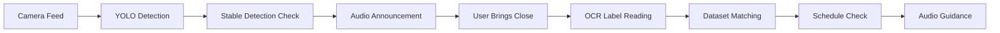

# Medicine Detection Assistant

A Python application that detects medicines in real-time using YOLOv8 and provides audio feedback with spatial guidance, helping visually challenged users locate and identify medicines around them.
This project combines object detection, text-to-speech, and stable detection logic to ensure accurate and reliable announcements.

## Overview

Visually challenged individuals often struggle to identify medicines and follow correct schedules, risking health and independence. The Assistive Recognition System addresses this by combining real-time YOLOv8s detection, a 5-layer OCR pipeline, and audio guidance to identify medicines, read labels, and provide hands-free feedback. Temporal stability, spatial reasoning, and personalized schedule matching ensure accurate and actionable guidance, making medicine intake safer and more independent.

## Objective

To design an AI-based assistive system that can:

- Detect medicines in real time
- Provide audio-based guidance
- Verify medicine labels using robust OCR
- Support correct medicine intake through scheduling

## Key Features

- **Real-Time Medicine Detection:** YOLOv8 with multi-frame validation ensures accurate recognition of medicines in varied environments.

- **Advanced OCR Pipeline:** 5-layer preprocessing (grayscale, adaptive threshold, Otsu + denoising, contrast enhancement, inversion) provides robust label reading.

- **Audio Feedback & Guidance:** Context-aware, hands-free directional and spatial guidance for safe and independent use.

- **Personalized Medicine Schedule:** Matches detected medicines to intake times, reducing dosage errors.

- **User Interaction Modes:**

  - **Scan:** Detects all medicines in the environment and announces their locations.
  - **Guide:** Directs the user to bring a medicine closer for scanning.
  - **Select:** Activates a chosen medicine and provides positioning guidance.
  - **Read:** Runs OCR to read labels and provides audio confirmation of name and dosage.

- **Spatial & Temporal Reasoning:** Bounding box analysis and multi-frame validation ensure stable, accurate detection.

- **Error Handling:** 5-layer OCR fallback and audio warnings manage low-quality labels, low-confidence detections, and schedule conflicts.

- **Integration & Extensibility:** Connects with medicine database, user schedule, headphones, and mobile app; modular design supports third-party services and future expansion.

- **Robustness:** Fast, responsive processing balances accuracy, speed, and usability for real-world deployment.

---

## Custom Dataset

The YOLOv8 model was trained on a custom dataset collected by us, designed specifically for real-life use by users.

### Dataset Characteristics

- ~420 total images
- Images captured in real environments:
  - Medicines on tables, cupboards, beds, and floors
  - Medicines held in hand (different angles and distances)
  - Top-view and side-view variations
- Diverse lighting conditions and backgrounds

### Why Custom Data?

Generic datasets are not sufficient for this use case.  
The dataset was intentionally designed to teach the model:

- Context awareness (medicine on surface vs in hand)
- Realistic placement scenarios
- Robust detection in cluttered environments

---

## Model Training Details

- **Model:** YOLOv8s (11.16M parameters)
- **Input Resolution:** 640×640 pixels
- **Batch Size:** 16
- **Epochs:** 60
- **Dataset:** Custom 420-image dataset capturing medicines in varied environments, angles, and lighting conditions
- **Augmentation:** None (The model was trained purely on real captured images without synthetic augmentation. This ensures that detections reflect real-world conditions encountered by visually challenged users, at the cost of requiring careful data collection.)
- **Optimizer:** Auto
- **Early Stopping:** Patience = 25
- **Hardware:** NVIDIA Tesla T4 GPU (16 GB VRAM), CUDA 12.4

**Why YOLOv8s?**  
Chosen for real-time performance, high precision/recall, and low latency. Its single-stage architecture enables fast processing for hands-free context-aware guidance.

---

## Model Performance

### Overall Performance Metrics of Model version 2.0

| Metric    | Value |
| --------- | ----- |
| Precision | 0.919 |
| Recall    | 0.846 |
| mAP@50    | 0.893 |
| mAP@50–95 | 0.700 |

These results indicate:

- **High precision**, reducing false detections
- Strong recall for consistent detection
- Reliable generalization across varied environments

---

## Training & Evaluation Curves For Model Version 2.0:

The following curves were analyzed to evaluate model performance:

### Precision–Recall Curve


### F1 Score Curve


### Precision Curve


### Recall Curve


### Training Summary


---

## CLI Method To Run the model

```bash
python my_model/yolo_detect.py --model my_model_v2/my_model_v2.pt --source 0 --thresh 0.5 --resolution 640x480
```

## How It Works



1. **Detection** - YOLOv8 identifies medicines in real-time
2. **Stability Check** - Confirms object presence for 1 second.
3. **Position Announcement** - Provides spatial audio feedback
4. **Verification** - Uses OCR to read medicine labels
5. **Matching** - Cross-references with user's medicine database
6. **Guidance** - Suggests appropriate medicine based on schedule

---

## Technical Architecture


---

## OCR

### Advanced OCR Pipeline

A 5-layer preprocessing pipeline ensures robust label recognition:

1. **Grayscale Conversion:** Converts cropped regions of interest to grayscale for uniform processing.
2. **Adaptive Thresholding:** Enhances contrast for variable lighting conditions.
3. **Otsu Denoising:** Removes noise and small artifacts for clearer text extraction.
4. **Contrast Enhancement:** Improves readability of low-contrast labels.
5. **Inverted Image OCR:** Handles reversed or colored text on labels.

- **Fallbacks:** If one preprocessing layer fails to produce readable text, the system automatically selects the best result from other layers.

---

## Use Cases

- Daily medication management for visually challenged individuals
- Medication verification before consumption
- Schedule adherence assistance
- Independent living support
- Caregiver support tool

## Future Roadmap

- [ ] Mobile app deployment (iOS/Android)
- [ ] Voice command integration
- [ ] Cloud-based dataset synchronization
- [ ] Pill reminder notifications
- [ ] Emergency contact alerts
- [ ] Handwritten prescription OCR
- [ ] Multi-language support

## Conclusion

The Assistive Recognition System combines real-time YOLOv8s detection, a robust 5-layer OCR pipeline, spatial & temporal reasoning, and audio guidance to enable visually challenged users to locate, identify, and safely consume medicines independently.  
Its modular and extensible design ensures low-latency performance, context-aware guidance, and future scalability with mobile apps, cloud sync, multi-language support, and wearable integration.

## License

This project is licensed under the MIT License - see the [LICENSE](LICENSE) file for details.

# Disclaimer !!!

This application is designed to assist with medication management but **should not replace professional medical advice**. Always consult healthcare providers regarding medication usage and management.
